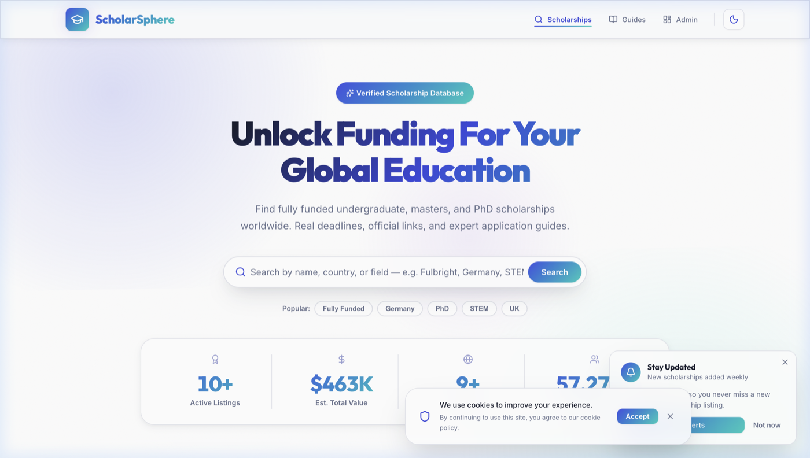
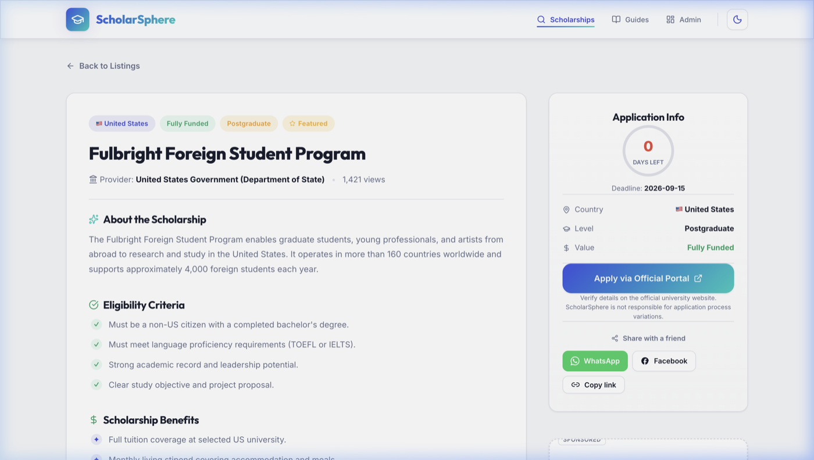
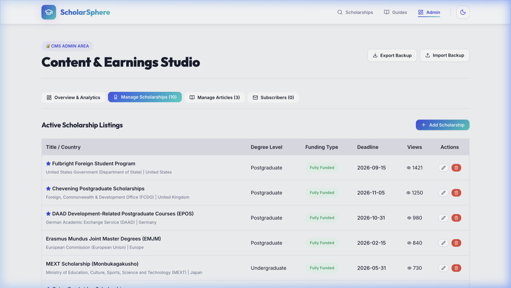

# 🎓 ScholarSphere — International Scholarship & Fellowship Portal

[](https://imami123456.github.io/Scholarship-website-/)
[](https://www.typescriptlang.org/)
[](https://react.dev/)
[](https://vitejs.dev/)
[](https://vitest.dev/)
[](.github/workflows/ci.yml)
[](LICENSE)

> A modern single-page application built with React 19, TypeScript, and a custom vanilla CSS design system. Features an international scholarship discovery engine, deep-linking hash router, programmatic Schema.org JSON-LD SEO, study guides publisher, and an in-browser Content Management System (CMS) with data backup/restore and subscriber management.

---

## 📸 Screenshots

### 1. Scholarship Directory & Multi-Parameter Filter Engine


### 2. Comprehensive Scholarship Details View


### 3. In-Browser Content Management System (CMS) & Studio


---

## 💡 Overview & Engineering Focus

ScholarSphere is designed to solve the fragmentation in international educational funding discovery. It provides students worldwide with a fast, accessible directory of fully funded and partial scholarships (e.g., Fulbright, Chevening, DAAD, Erasmus Mundus) along with actionable application guides.

From an engineering perspective, this project focuses on:
- **Zero-Dependency Styling:** Rather than relying on heavy CSS frameworks (like Tailwind or Bootstrap), the entire interface is styled with a modular, 1,170-line custom CSS design system using HSL color tokens, glassmorphism, responsive grids, and micro-animations.
- **Native Lightweight Hash Routing:** A zero-dependency hash router supporting deep-linking (`#scholarship/:id`, `#blog/:slug`, `#admin`) and browser history without requiring server rewrite configuration on static hosts like GitHub Pages.
- **Programmatic SEO Engine:** Dynamic runtime injection of Schema.org JSON-LD structured data (`WebSite`, `Scholarship`, `BlogPosting`), OpenGraph tags, and canonical links.
- **In-Browser Content Management System (CMS):** A full administrative dashboard allowing content creators to create, edit, delete, export/import JSON database backups, and manage email newsletter subscribers.
- **Strict TypeScript Modeling:** Robust domain types ensuring complete type-safety across filter parameters, scholarship records, blog articles, and subscriber records.

---

## ✨ Key Features

### 1. 🔍 Multi-Parameter Scholarship Search & Filter
- **Full-Text Search:** Instant keyword matching across scholarship titles, providers, and descriptions.
- **Faceted Filters:** Filter simultaneously by Country, Degree Level (`Undergraduate`, `Postgraduate`, `PhD`, `Short Courses`), Funding Coverage (`Fully Funded`, `Partial`, `Tuition Waiver`), and Field of Study (`STEM`, `Humanities`, `Business`, `Medicine`).
- **Deadline Proximity & Sorting:** Calculates remaining application days and automatically sorts listings chronologically by upcoming deadline.
- **Featured Toggle:** Quickly isolates premier government and institutional fellowships.

### 2. 📄 Rich Scholarship Dossiers
- Clear breakdown of eligibility requirements, financial benefits (airfare, stipend, tuition, health coverage), and step-by-step application instructions.
- Direct links to official institutional application portals.
- Integrated YouTube video walkthroughs for "how to apply" guidance.
- 1-click social share actions for WhatsApp and Facebook with pre-filled metadata.

### 3. 📝 Study Guides & Knowledge Hub
- Application strategy articles (e.g., *How to Write a Winning Motivation Letter* with copyable structural templates).
- Estimated reading time calculation and category tags.

### 4. ⚙️ In-Browser Content Management Studio (CMS)
- Accessible via `#/admin`.
- **Scholarships Management:** Add, edit, and delete listings with form validation.
- **Articles Management:** Write and publish application guides.
- **Subscribers Management:** Review newsletter signups, delete entries, and export to CSV.
- **Database Backup & Migration:** 1-click JSON database export and instant JSON backup restoration.
- **Simulated Analytics:** Real-time calculation of simulated traffic and CPM/AdSense revenue based on page views.

### 5. 🌐 Programmatic SEO & Structured Data
- Injects Schema.org JSON-LD into `document.head` dynamically on route changes:
  - `Scholarship`: Maps title, provider organization, award amount, and expiration date (`validThrough`).
  - `BlogPosting`: Maps headline, author, publishing date, and article body.
  - `WebSite`: Fallback search engine site representation.

---

## 🏛️ Architecture & Technical Decisions

| Decision | Approach Chosen | Rationale & Trade-offs |
|---|---|---|
| **Routing** | Native Hash Router (`window.location.hash`) | Standard HTML5 `BrowserRouter` requires server rewrite rules to avoid 404 errors on static hosts like GitHub Pages. A custom hash router provides deep-linking (`#scholarship/1`, `#admin`), back-button history navigation, and zero server configuration. |
| **Styling** | Custom Vanilla CSS Design System (`src/index.css`) | Built a 1,170-line tokenized design system using HSL color variables (`--primary`, `--accent`, `--gold`), glassmorphism, and responsive CSS grid. Demonstrates core CSS3 proficiency without external framework bloat. |
| **Data Persistence** | `localStorage` Synchronization | Synchronizes state changes to browser storage with initial seed fallback, allowing full client-side CRUD and CMS testing without requiring a dedicated backend service. |
| **Programmatic SEO** | Dynamic DOM Head & JSON-LD Injection (`src/utils/seo.ts`) | Since static client-rendered SPAs lack server-side rendering (SSR), programmatic DOM injection ensures rich metadata, Open Graph cards, and structured JSON-LD are generated accurately for crawlers and scrapers. |
| **Testing** | Vitest with Happy-DOM Environment | Lightweight, fast unit testing executed in under 500ms covering SEO generation, filtering algorithms, YouTube URL regex parsing, and subscriber deduplication. |

---

## 🧪 Testing Suite

ScholarSphere includes an automated unit test suite powered by **Vitest** with **29 passing tests** across 4 test suites:

- **`tests/seo.test.ts` (6 tests):** Validates title updates, OpenGraph and Twitter meta tag generation, and Schema.org `WebSite`, `Scholarship`, and `BlogPosting` JSON-LD structures.
- **`tests/filters.test.ts` (7 tests):** Tests multi-factor filtering (keyword search, country, degree level, funding type, field of study, featured flag) and chronological deadline sorting.
- **`tests/config.test.ts` (10 tests):** Tests regex parsing of YouTube URLs (`getYouTubeId`) across watch links, short URLs, embed URLs, YouTube Shorts, and bare IDs; validates WhatsApp and Facebook share link generators.
- **`tests/subscribers.test.ts` (6 tests):** Tests email format validation, whitespace normalization, case-insensitive deduplication, and removal logic.

```bash
# Run unit test suite
npm run test

# Run tests in watch mode
npm run test:watch
```

---

## 🛠️ Tech Stack & Tooling

- **Core:** React 19, TypeScript 5, Vite 8
- **Styling:** Vanilla CSS3 (Custom Design System, CSS Variables, Glassmorphism, Responsive Grid)
- **Icons:** Lucide React
- **Testing:** Vitest, Happy-DOM
- **Code Quality:** ESLint 10 with TypeScript ESLint Flat Config
- **CI / CD:** GitHub Actions (automated linting, testing, building, and GitHub Pages deployment)

---

## 📁 Project Structure

```
Scholarship-website-/
├── .editorconfig                # Formatting & indentation standards
├── .github/
│   └── workflows/
│       ├── ci.yml               # Automated CI (lint, test, build)
│       └── deploy.yml           # Automated GitHub Pages deployment
├── docs/
│   └── images/                  # Application screenshots
│       ├── home.png
│       ├── scholarship-details.png
│       └── admin-dashboard.png
├── tests/
│   ├── config.test.ts           # URL regex and share link tests
│   ├── filters.test.ts          # Scholarship search and filter tests
│   ├── seo.test.ts              # Schema.org JSON-LD and meta tag tests
│   └── subscribers.test.ts      # Email validation and subscriber management tests
├── src/
│   ├── components/
│   │   ├── Header.tsx           # Brand header with route navigation
│   │   ├── Footer.tsx           # Footer with links, disclaimers & email signup
│   │   ├── CommunityCTA.tsx     # Social and channel community cards
│   │   ├── EmailSubscribe.tsx   # Newsletter capture component
│   │   ├── NotifyPopup.tsx      # Timed lead capture modal
│   │   ├── ShareButtons.tsx     # WhatsApp and Facebook share links
│   │   ├── AdBanner.tsx         # Responsive banner ad slots
│   │   ├── SocialBar.tsx        # Floating social media quick bar
│   │   ├── VideoEmbed.tsx       # Responsive YouTube video container
│   │   └── CookieConsent.tsx    # GDPR cookie consent banner
│   ├── pages/
│   │   ├── Home.tsx             # Directory hero, stats & filterable listing
│   │   ├── ScholarshipDetails.tsx # Detailed scholarship dossier & JSON-LD
│   │   ├── Blog.tsx             # Guide listing & category filters
│   │   ├── BlogPostDetails.tsx  # Article reader with progress tracker
│   │   └── AdminDashboard.tsx   # In-browser CMS studio & analytics
│   ├── data/
│   │   ├── initialScholarships.ts # Seed international scholarship records
│   │   └── initialBlogs.ts      # Seed guide articles
│   ├── utils/
│   │   └── seo.ts               # Programmatic SEO & Schema.org engine
│   ├── config.ts                # App configuration, subscriber storage & helpers
│   ├── types.ts                 # TypeScript domain interfaces
│   ├── App.tsx                  # Hash router & root state orchestrator
│   ├── main.tsx                 # React DOM mount point
│   └── index.css                # 1,170-line custom vanilla CSS design system
├── index.html                   # HTML template with SEO meta tags & favicon
├── tsconfig.json                # TypeScript project configuration
├── vite.config.ts               # Vite configuration with relative base & Vitest setup
├── LICENSE                      # MIT License
└── package.json
```

---

## 🚀 Getting Started

### Prerequisites
- Node.js (version 18 or higher)
- npm, pnpm, or yarn

### Installation & Setup

1. **Clone the repository:**
   ```bash
   git clone https://github.com/Imami123456/Scholarship-website-.git
   cd Scholarship-website-
   ```

2. **Install dependencies:**
   ```bash
   npm install
   ```

3. **Start local development server:**
   ```bash
   npm run dev
   ```
   Open `http://localhost:5173/` in your browser.

4. **Run unit tests:**
   ```bash
   npm run test
   ```

5. **Run the linter:**
   ```bash
   npm run lint
   ```

6. **Build for production:**
   ```bash
   npm run build
   npm run preview
   ```

---

## 📄 License

This project is open-source and available under the [MIT License](LICENSE).
